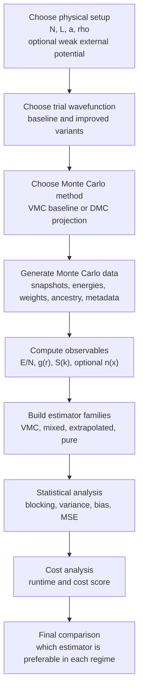

# High-Level Workflow

This document gives the supervisor-facing workflow of the project, from generating samples to estimating observables and comparing estimator families.

## 1. One-line summary

```text
choose the hard-rod setup -> choose a trial state -> generate samples with VMC or DMC -> compute observables -> compare estimators by error and cost
```

## 2. Main workflow



## 3. Workflow by stage

### Stage 1. Choose the physical benchmark

The benchmark is the one-dimensional hard-rod Bose gas on a periodic ring.

At this stage the main physical choices are:

- number of particles `N`
- ring length `L`
- rod length `a`
- density `rho = N/L`
- density regime: low, intermediate, or high
- optional weak external potential for later extensions

This step fixes the physical problem that will be sampled.

### Stage 2. Choose the trial wavefunction

The next choice is the trial state `Psi_T`.

This is one of the intended comparison points of the project. The repository is designed to support more than one trial family, for example:

- the current nearest-neighbor Jastrow-like trial
- the reduced-coordinate all-pair hard-rod trial
- possibly improved or supervisor-provided trial forms later on

This matters because:

- VMC samples directly from `|Psi_T|^2`
- DMC starts from `Psi_T`
- mixed-estimator bias depends on trial quality

### Stage 3. Choose the Monte Carlo method

The repository is organized around two Monte Carlo workflows:

- `VMC` as a baseline
- `DMC` as the ground-state projection method

Within the DMC workflow, `forward walking` is used for pure-estimator construction.

This is another intended variation point. In practice, comparisons may include:

- VMC versus DMC
- different DMC time steps
- different walker populations
- different forward-walking lags
- repeated seeds for stability checks

### Stage 4. Generate Monte Carlo data

Once the physical setup, trial state, and method are fixed, the code generates data.

Depending on the method, the generated data include:

- coordinate snapshots
- local energies
- weights
- ancestry information
- runtime
- metadata such as seed, burn-in, thinning, time step, and walker number

This is the raw numerical output from which observables are computed.

### Stage 5. Compute observables

The observable layer turns coordinate data into physically interpretable quantities.

The main observables are:

- energy per particle `E/N`
- pair distribution function `g(r)`
- static structure factor `S(k)`
- optional density profile `n(x)`

The same observable code should work regardless of whether the underlying data came from VMC, mixed DMC, or forward-walking pure estimation.

### Stage 6. Build the estimator families

The project is designed to compare four estimator families:

- VMC estimator
  ```text
  O_VMC = <Psi_T|O|Psi_T> / <Psi_T|Psi_T>
  ```
- mixed DMC estimator
  ```text
  O_mixed = <Psi_T|O|Psi_0> / <Psi_T|Psi_0>
  ```
- extrapolated estimator
  ```text
  O_ext = 2 O_mixed - O_VMC
  ```
- pure estimator
  ```text
  O_pure = <Psi_0|O|Psi_0> / <Psi_0|Psi_0>
  ```

This is a post-processing stage. The observable implementations remain in `estimators/`, while the estimator-family assignments and the extrapolated combination are assembled afterward from VMC and DMC outputs.

### Stage 7. Perform the statistical analysis

After the estimators are produced, their statistical quality must be assessed.

The main quantities are:

- blocking-aware uncertainty estimates
- variance
- bias relative to a benchmark or reference
- mean-squared error

The main formulas are:

```text
bias = mean(O_hat) - O_ref
MSE = bias^2 + variance
```

### Stage 8. Perform the cost analysis

The thesis is not only asking which estimator is more accurate. It is asking which estimator is preferable once computational cost is included.

For that reason, runtime is tracked and combined with the statistical analysis.

The practical benchmark metric is:

```text
cost_score = MSE * runtime
```

## 4. Where the project will deliberately try alternatives

The workflow is not meant to be run with only one fixed configuration. Several choices are expected to be varied systematically.

### Physical variations

- low, intermediate, and high density regimes
- uniform system versus weakly inhomogeneous extension

### Trial-wavefunction variations

- simple baseline trial
- more structured hard-rod trial
- possible improved trial forms later on

### Method variations

- VMC versus DMC
- different DMC time steps
- different walker numbers
- different forward-walking lengths

### Estimator variations

- mixed
- extrapolated
- pure

The point of the thesis is to understand which combinations are worth using for which observables.

## 5. Final output

The intended final output is a recommendation map of the form:

```text
observable x density regime x estimator family
-> bias, variance, MSE, runtime, preferred choice
```

In practical terms, the thesis is aimed to answer questions such as:

- when is the mixed estimator already accurate enough?
- when is the extrapolated estimator the best compromise?
- when is forward-walking pure estimation worth the extra cost?
