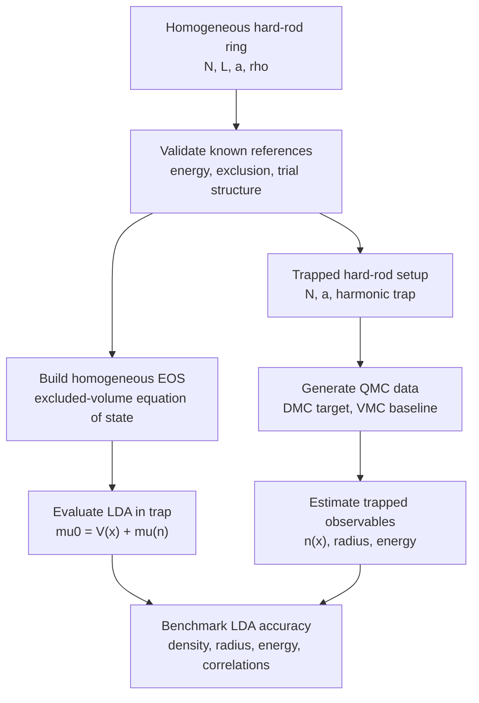

# High-Level Workflow

This document gives the supervisor-facing workflow for the revised thesis direction. The homogeneous hard-rod ring is the validation benchmark. The trapped hard-rod gas is the main thesis problem.

## 1. One-line Summary

```text
validate homogeneous hard rods -> build trapped QMC workflow -> evaluate excluded-volume LDA -> map accuracy and failures
```

## 2. Main Workflow



## 3. Phase 1: Homogeneous Validation

The homogeneous system is the one-dimensional hard-rod Bose gas on a periodic ring. It is not the final physics target; it is the calibration problem used to confirm that the implementation respects the known excluded-volume reference.

The validation choices are:

- particle number `N`;
- ring length `L`;
- rod length `a`;
- density `rho = N/L`;
- packing fraction `rho * a`.

The validation outputs are:

- exact finite-`N` energy per particle;
- thermodynamic-limit equation of state;
- hard-core exclusion checks;
- trial-wavefunction sanity checks;
- optional structural observables such as `g(r)` and `S(k)`.

## 4. Phase 2: Trapped-System Definition

The main system is a one-dimensional hard-rod gas in an external trap. The immediate target is a harmonic potential.

The trapped model needs:

- open-line coordinates rather than periodic wrapping;
- nearest-neighbor exclusion on the line;
- a harmonic external potential;
- valid trapped initial configurations;
- observables that do not assume periodic boundary conditions.

The primary trapped observables are:

- density profile `n(x)`;
- cloud radius or edge position;
- total energy;
- potential-energy contribution;
- selected correlations if they remain useful.

## 5. Phase 3: QMC Data Production

VMC remains useful for smoke tests, trial-state diagnostics, and fast end-to-end runs. DMC is the intended ground-state production method.

The sampling layer should emit:

- coordinate snapshots;
- local energies when available;
- weights when available;
- runtime and configuration metadata;
- ancestry only if pure-estimator support is needed later.

Estimator-family machinery remains secondary infrastructure. It can support the comparison, but the thesis endpoint is not estimator ranking.

## 6. Phase 4: Excluded-Volume LDA

The LDA reference is evaluated from the homogeneous hard-rod equation of state:

$$
e_{\mathrm{HR}}(\rho)
=\frac{\pi^2\rho^2}{3(1-a\rho)^2}.
$$

with energy density

$$
\epsilon_{\mathrm{HR}}(\rho)
=\rho e_{\mathrm{HR}}(\rho)
=\frac{\pi^2\rho^3}{3(1-a\rho)^2}.
$$

and chemical potential

$$
\mu_{\mathrm{HR}}(\rho)
=\frac{d\epsilon_{\mathrm{HR}}}{d\rho}
=\frac{\pi^2\rho^2(3-a\rho)}{3(1-a\rho)^3}.
$$

For a trap, the local density satisfies

$$
\mu_0 = V_{\mathrm{trap}}(x) + \mu_{\mathrm{HR}}\!\left(n_{\mathrm{LDA}}(x)\right)
$$

with `mu0` fixed by normalization:

$$
\int n_{\mathrm{LDA}}(x)\,dx = N.
$$

## 7. Phase 5: Trapped QMC Benchmarks of LDA

The main comparison is direct and observable-level:

```text
n_benchmark(x) versus n_LDA(x)
R_benchmark    versus R_LDA
E_benchmark    versus E_LDA
```

The parameter sweep should vary only the quantities needed to answer the thesis question:

- particle number;
- rod length or packing scale;
- trap strength;
- DMC time step and walker count as numerical controls.

## 8. Optional Extension

Only after the trapped hard-rod comparison is complete, the excluded-volume idea may be tested against selected Lieb-Liniger excited-state or correlation-function quantities. This should remain a narrow optional extension, not a second thesis.
